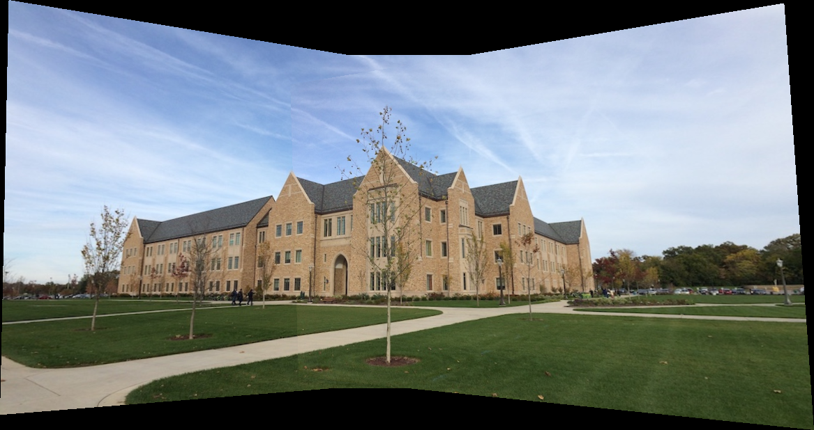
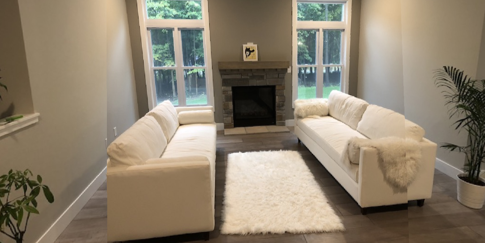

# CSE 398/498. Assignment 4
#### Student Name: Alibek Kaliyev
#### Email: alk224@lehigh.edu


## Usage
For the code to work, you need to have MATLAB installed on your computer. Use MATLAB software to run all of the scripts.


### Task 1

1. Open the file named ```imageStitching_2images.m``` in ```/src``` folder using MATLAB. Run the script. It will display the result of the image stitching. The result will be saved in ```/output``` folder with the name ```panorama_2images.png```.
2. Open the file named ```inverseWarpingInteractive.m``` in ```/src``` folder using MATLAB. Run the script.
3. Choose four points on the image that was displayed that will indicate boundaries of the resulting image. After that double click on the image, and the result of the inverse image warping will be displayed. The result will be saved in ```/output``` folder with the name ```panorama_2images_cropped_inverse_warping.png```.

Here is the result of the image stitching for 2 images:


Here is the result of the inverse image warping:


### Task 2

1. Open the file named ```imageStitching_3images.m``` in ```/src``` folder using MATLAB.
2. You can also change the ```folder_name``` in the beginning of the script to use your own images. The folder should contain three images with the names ```1.jpg```, ```2.jpg```, and ```3.jpg```.
3. Run the script. It will display the result of the image stitching. The result will be saved in ```/output``` folder with the name ```panorama_3images.png```.

Here is the result of the image stitching for 3 images:


### Task 3

The result of task 2 is not great: the right image is heavily deformed. **What could be the reason for this?** The reason for this is that the right image is not aligned with the left image. In fact, the right image performs an estimation of geometric transformation on the already stitched image between the left and the middle images. The middle image is already misaligned with the left image, so the right image is misaligned even more with the left image. This is why the right image is heavily deformed.

To fix this, we should have a middle image as a reference image (identity matrix). We should align the left image with the middle image, and then align the right image with the middle image. This way, the right image will be aligned with the left image.

Steps to run the code:
1. Open the file named ```imageStitching_3images_reordered.m``` in ```/src``` folder using MATLAB.
2. You can also change the ```folder_name``` in the beginning of the script to use your own images. The folder should contain three images with the names ```1.jpg```, ```2.jpg```, and ```3.jpg```.
3. Run the script. It will display the result of the image stitching. The result will be saved in ```/output``` folder with the name ```panorama_3images_{folder_name}_reordered.png```.

Here is the result of the image stitching for 3 images using different images:



And the inverse image warping:


Here is the result of the image stitching for 3 images for horizontal room:


And the inverse image warping:



Here is the result of the image stitching for 3 images for vertical room:


And the inverse image warping:


### Task 4


